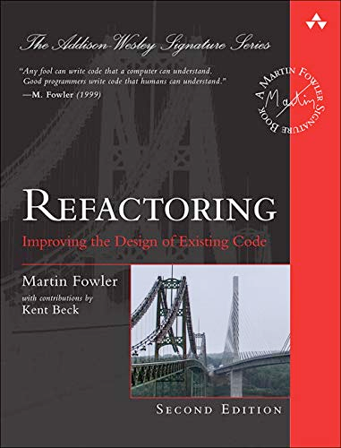

# Refactoring
> [Refactoring is a disciplined technique for restructuring an existing body of code, altering its internal structure without changing its external behavior.](https://refactoring.com/)

I'm using this repository to study the book's examples.  
I'm reading Second Edition in Brazilian Portuguese, trying to keep everything in english in the code.